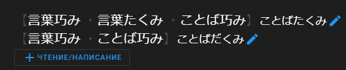
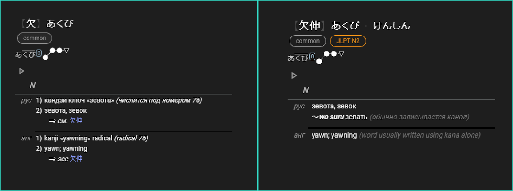

# Заголовок

Как мы уже разбирали ранее, заголовок состоит из «Слов» (каждая строка в заголовке соответствует отдельному «Слову»), каждое слово состоит из одного-нескольких чтений и написаний.

Чтение обязательно состоит только из хираганы/катаканы (в редакторе они пишутся латиницей), всё остальное же будет написанием.

Примеры написаний: 腰をくねらせる, 変更, α, α線維, ＬＵ分解, Ｍ２層, ２０００

Примеры чтений: アースずきコンセント, コルンブいし

Из этого следует, что в статьях слов-гайрайго (и других, которые состоят из одной только каны) будет отсутствовать написание.

### Чтение

Для записи чтения в НЯРСе используется латиница, представленная немного модифицрованной системой Хэпбёрна (см. [«Транскрипции»](/jp-ru/Транскрипции.html)).

Вы можете использовать для указания чтений кану, она будет автоматически сконвертирована в латиницу при сохранении правки, однако нужно иметь в виду, что возможны неоднозначные ситуации, в которых конвертация не сможет правильно отработать. Например, おう конвертируется в o:, но в некоторых ситуациях необходима запись ou (この上 -> このうえ -> kono:e, а должно быть konoue/kono ue).

Также при указании чтения рекомендуется разбивать его пробелами по границе слов (в том числе в составных словах). Пробелы можно использовать как при записи латиницей, так и при записи каной. Например: この上 -> この うえ, 腰をくねらせる -> koshi wo kuneraseru, 無担保転換社債 -> mutanpo tenkan shasai

#### Теги чтения

- (более) редкое чтение -- ミュンヒェン вместо более частого ミュンヘン
- ~~нестандартная запись каной -- テケツ вместо チケット~~
- гикун (чтение по смыслу) или дзюкудзикун (особенное чтение) -- 煙草 たばこ
- ошибочное, неправильное чтение -- 月極 げっきょく
- старая орфография (кю-канадзукай) или архаичное чтение -- ゐ・ゑ・いふ в 言う・かは в 川・たけ вместо だけ・腕 かいな／かひな а не うで

### Написание

#### Теги написания

- атэдзи (фонетическое использование кандзи) -- 滅茶苦茶・露西亜・烏克蘭・泥烏須
- дзюкудзикун (подобранный по смыслу кандзи с нестандартным чтением) -- 五月雨 майский дождь・部屋 часть дома
- неправильное, ошибочное написание -- 烏竜茶 -> 鳥竜茶
- нестандартная запись окуриганы -- 物語 -> 物語り
- нестандартная/редкая запись кандзи -- 布団 -> 蒲団, 切断 -> 截断
- устаревшее написание, кюдзитай формы -- 断截 -> 斷截

#### Устаревшее написание

Запись традиционными иероглифами необходимо указывать только в том случае, если обратная конвертация (из упрощённой формы в традиционную) неочевидна. Например:

嵐気 -> 嵐氣, в данном случае иероглифу 気 соответствует только 氣, значит написание 嵐氣 в статью включать не нужно.

弁慶 -> 辨慶, иероглифу 弁 соответствует несколько традиционных, значит традиционное написание нужно включить в статью.

На написания, содержащие традиционные иероглифы, необходимо повесить тег «устаревшее написание, кюдзитай формы».

#### Замена иероглифа на кану

Иногда встречаются слова, в которых один/несколько иероглифов заменены на их чтения.

Такие написания следует включать в статью, если они широко распространены.

Например: 濾過器 -> ろ過器

### Слова

В рамках статьи «Словом» считается комбинация чтений + написаний, визуально слово соответствует одной строке в заголовке.

Как правило, в статье должно быть только одно слово (=строка с чтениями и написаниями), но в исключительных ситуациях в статью могут быть добавлены ещё слова, это делается при помощи кнопки «+чтение/написание».

Рассмотрим такую исключительную ситуацию на примере статьи «言葉巧み».

У этого слова есть несколько вариантов записи и чтений, но не все варианты записи слова читаются одинаково. Запись «**言葉巧み・言葉たくみ・ことば巧み**» может читаться как «**ことばたくみ**», а вот запись «**言葉巧み・ことば巧み**» имеет также чтение «**ことばだくみ**». Так как «言葉たくみ» не может читаться как «ことばだくみ», необходимо создать отдельное написание и чтение, нажав на кнопку «+чтение/написание». В таком случае чтения и значения будут находится не на одной строчке, а на двух разных.

Такое допустимо только при полной эквивалентности слов, в противном случае необходимо создать две отдельные статьи, как показано в примере ниже.

