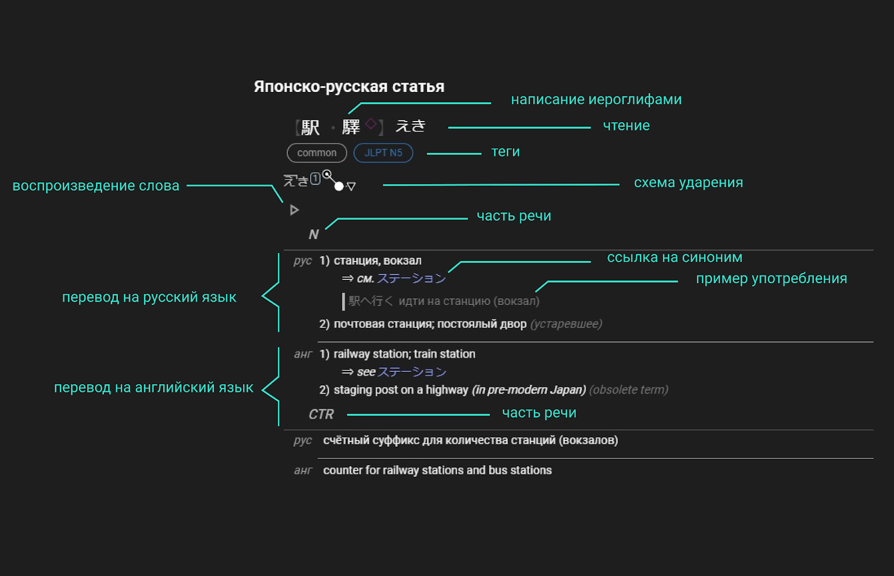
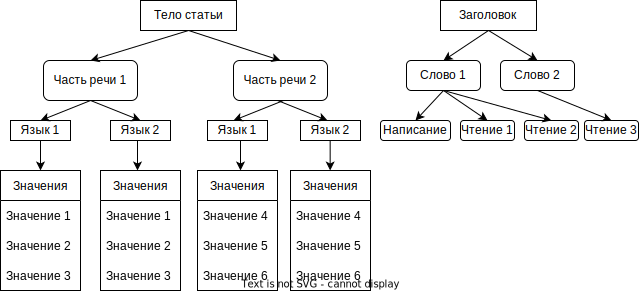
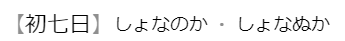
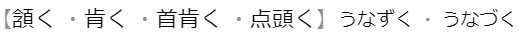
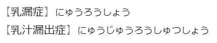

# Общие сведения

### Структура статьи

Статьи в НЯРСе имеют древовидную структуру.

В заголовке каждая отдельная строка может содержать несколько чтений и несколько написаний. Для каждого чтения или написания есть свой набор тегов. Совокупность чтения и написания (иными словами, каждая отдельная строка в заголовке) в рамках статьи называется «словом».

Тело статьи состоит из блоков частей речи (для одного такого блока может быть указано несколько частей речи). Каждый такой блок включает в себя один-несколько языков, а уже в блоке языка указывается набор значений.

Можно представить эту структуру в виде диаграммы.

### Соответствие слов статье

В большинстве словарей одной статье соответствует только одна связка написание+чтение, однако в НЯРСе несколько таких связок могут быть объединены в одну статью.

Например 【初七日】しょなぬか и 【初七日】しょなのか, по сути это просто разные прочтения одного и того же слова. Обычно в словарях такие слова делятся на несколько статей, при этом одна из них будет основной, а все остальные будут на неё ссылаться. Однако в НЯРСе такие слова будут объединены в одну статью, в этом случае написанием будет 初七日, а чтениями しょなぬか и しょなのか.

Подобные объединения возможны только в тех случаях, когда значения абсолютно идентичны для всех указанных написаний/чтений и есть общее чтение и/или написание. Кроме того, при объединении нужно стремиться к тому, чтобы оставалась только одна строка с чтением/написанием (про исключения см. гл. [«Слова»](/jp-ru/Заголовок.html#Слова)).

#### Пример 1

Корректное объединение. Каждому написанию (слева) соответствует каждое из чтений (справа), таким образом в этом заголовке объединено 8 пар написание+чтение.

#### Пример 2

Некорректное объединение. Слова хоть и синонимичны, они не могут быть объединены по общему чтению и/или написанию.
