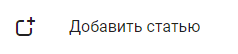
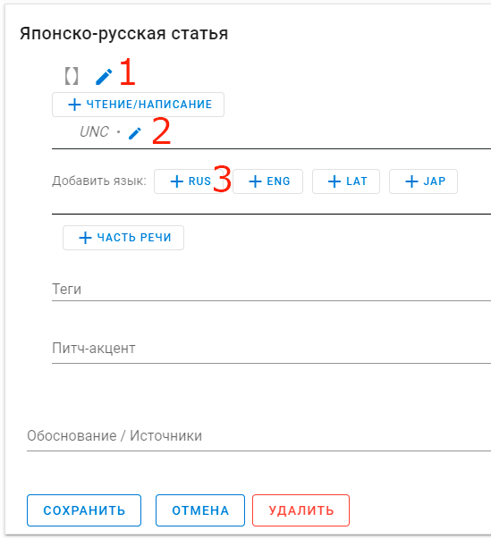
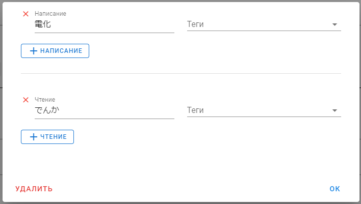
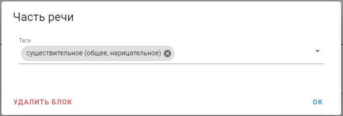
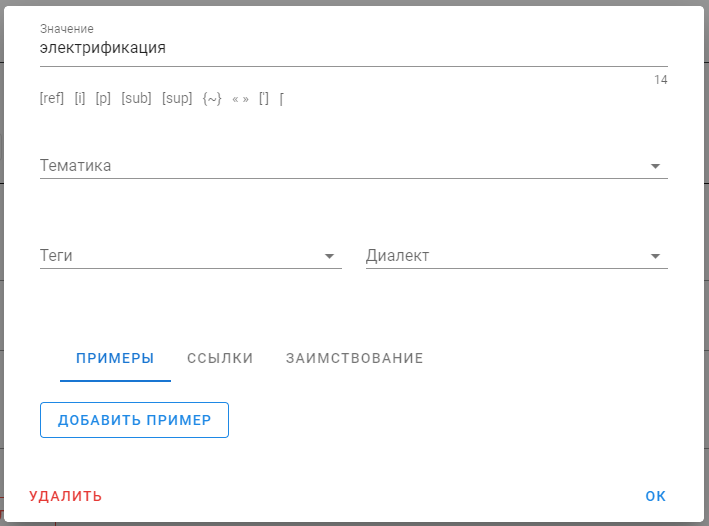
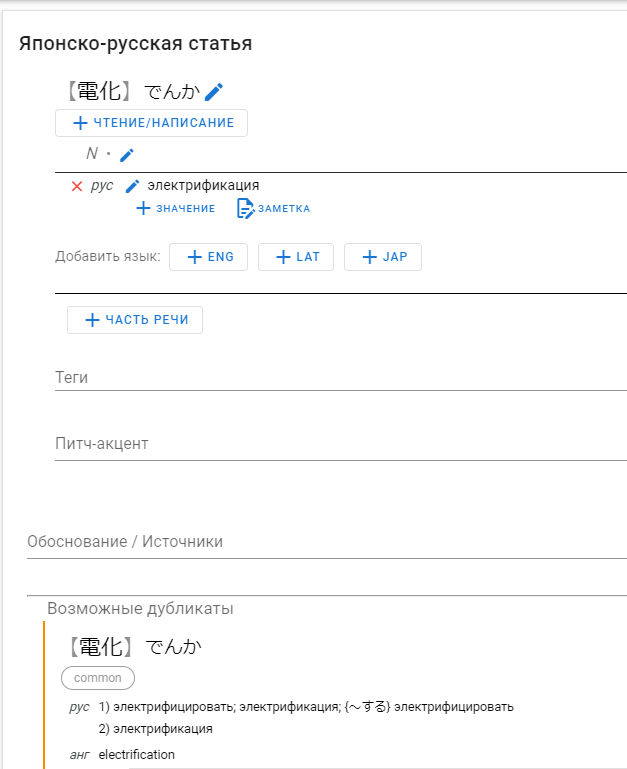

# Первая статья

### 0. Вступление

В этом руководстве мы с вами создадим самую простую статью для слова 電化.

Для начала откроем редактор новой статьи, для этого нажимаем в левом меню кнопку "Добавить статью".

Нам откроется редактор, в котором некоторые поля уже заполнены по умолчанию:

Теперь пошагово укажем всю нужную информацию.

### 1. Написание и чтение

Нажмём на иконку карандаша около скобок `【】`, нам откроется окно редактирования слова.

При помощи соответствущих кнопок мы можем добавить поля для написания и чтения, а затем указать их.

В нашем случае у слова `電化` написанием будет `電化`, а чтением `でんか`.

Должно получиться следующее:

Теперь можно закрыть это окно, нажав «ОК» или кликнув вне границ окна.

### 2. Часть речи

Часть речи в японско-русском словаре выставляется по японскому слову.

По умолчанию при создании статьи выставляется часть речи `UNC`, что значит «неклассифицировано».

Нажмём на иконку карандаша около части речи (см. №2 на первом изображении в статье), нам откроется окно редактирования части речи.

Чтобы удалить часть речи, надо нажать на крестик справа от неё.

Давайте удалим существующие части речи и добавим «существительное»:

Теперь можно закрыть это окно, нажав «ОК» или кликнув вне границ окна.

### 3. Язык и значение

Добавим к части речи язык (на котором будет дано значение), для этого нажмём на кнопку `+RUS`.

Появится блок значений на русском языке, в котором по умолчанию уже есть одно значение.

Отредактируем его, нажав на иконку карандаша слева от значения.

В открывшемся окне текст значения указывается в самом первом поле, давайте укажем там значение «электрификация» и нажмём «ОК», чтобы закрыть окно редактирования.

### 4. Сохранение

Таким образом у нас должна была получиться заполненная статья, как на скриншоте ниже:

В принципе, остаётся только нажать кнопку «Сохранить» внизу слева, будет создана новая правка, после проверки которой будет создана новая статья.

В нашем случае, такая статья уже существует, о чём нам говорит блок «Возможные дубликаты», поэтому добавлять такую статью смысла нет, но пользуясь этим руководством, вы можете добавить любое другое слово, которого ещё нет в словаре.

### 5. Заключение

Как вы могли заметить, в интерфейсе есть куча функционала, который мы не затрагивали.

Он разбирается в последующих главах этого руководства, однако не стоит пытаться запомнить все нюансы разом.

Правки в любом случае проходят премодерацию, так что даже если вы с чем-то ошибётесь, модераторы это поправят.

Кроме того, не стесняйтесь спрашивать непонятные/спорные моменты, для этого у нас есть сообщество в Discord, где вам обязательно помогут и ответят на ваши вопросы: [https://discord.gg/u7H5nsPWVB](https://discord.gg/u7H5nsPWVB)
