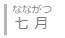

# Примеры, ссылки, заимствования

В окне редактирования значения внизу есть три вкладки: «Примеры», «Ссылки» и «Заимствования», рассмотрим их назначение.

### Примеры

Примеры в составе статей используются исключительно для уточнения значения.

Примеры, которые здесь указываются, должны не просто показывать употребление слова, а давать какую-либо дополнительную информацию, например, показывать глагольное управление. Кроме того, крайне рекомендуется сокращать примеры до минимально возможных словосочетаний.

Рассмотрим следующие ситуации:

> ふうとう【封筒】
>
> 封筒に封をする запечатывать конверт
>
> Хороший пример. Показано употребление слова, в словосочетании отсутствуют лишние слова.

> ふゆ【冬】
>
> 夏と冬どっちが好き？ Что ты больше любишь: лето или зиму?
>
> 新しく冬のコート買わなくちゃ。  Мне надо купить новое зимнее пальто.
>
> Плохие примеры. Не привносят никакой новой информации, являются распространёнными предложениями. Подобные примеры должны быть перенесены в словарь примеров.

Кроме того, в примерах могут приводиться составные слова, чтобы показать, как они образуются и какие возможны переводы.

> れんぱつ【連発・連ぱつ】
>
> 6連発拳銃 шестизарядный револьвер

#### Фуригана в тексте примера

В японском тексте примера можно указывать фуригану, для этого используются скобки `《 》` после иероглифа, который нужно подписать фуриганой. Например: `七《なな》月《がつ》` 

Фуригану стоит указывать только в спорных ситуациях.

### Ссылки

Ссылки используются для указания отношений между статьями. Отношения могут быть следующих типов:

- синоним - *слова полностью синонимичны*
- частичный синоним - *слова синонимичны не по всем значениям*
- антоним
- сравни - *прочие связи между словами*
- сокращение от

Для **синонимов** и **частичных синонимов** ссылка проставляется с менее популярного слова на более популярное. Например, 濾過器 и フィルター, フィルター в данный момент более популярное слово, поэтому в статье 濾過器 нужно проставить ссылку на フィルター (обратная ссылка с フィルター на 濾過器 не нужна). Если выбрать более популярное слово не представляется возможным, допустимо проставить двухстороннюю ссылку, однако в целях удобства предпочтительнее всё же выбирать основное слово, на которое будут ссылаться все остальные синонимы.

### Заимствования

В заимствовании указывается источник заимствования из другого языка. Например, チェックイン образовано от английского слова check-in.

Язык для заимствования указывается в соответствии с кодом [ISO 639-3](https://ru.wikipedia.org/wiki/Коды_языков#Коды_языков_по_ISO_639_и_ГОСТ_7.75-97) за исключением васэй-эйго, для них используется код `wasei`.
